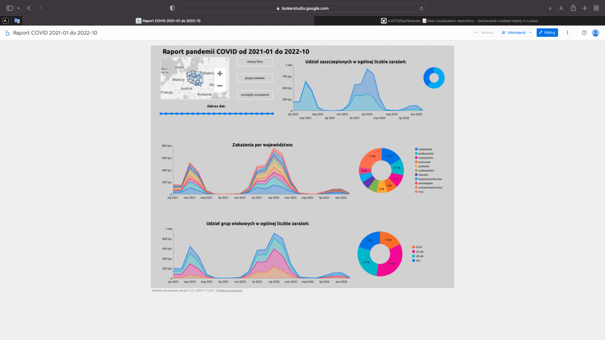
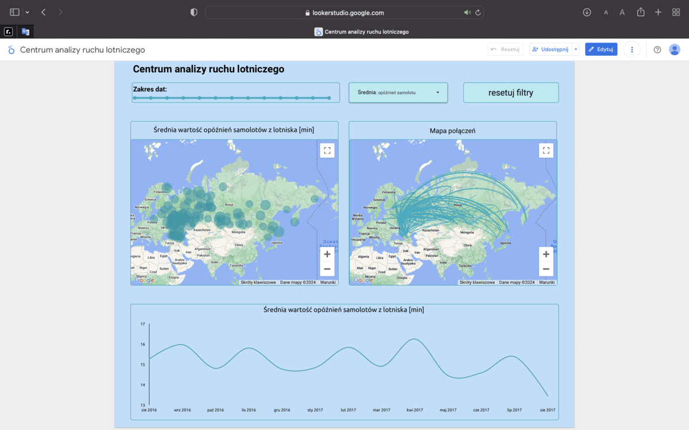

# Dashboards Repository

Welcome to my Dashboards repository! This repository contains various dashboards created using Looker and Tableau.

# Dashboards

## [Development of small renewable energy installations in Poland (MIOZE) from 2015 to present](https://lookerstudio.google.com/reporting/87431959-0863-438a-83f5-2c729cb24c3a)

### Description:
Explore the dynamic growth of small renewable energy installations (MIOZE) in Poland from 2015 to the present using data obtained through the API provided by dane.gov.pl. Our interactive maps allow users to filter data by province, select a range of years from 2015 to the present, and filter installations based on energy types such as solar, wind, hydro, biogas, and biomass.

### Key Features:

* **Interactive Maps**: Filter data by province to visualize the distribution of small renewable energy installations across Poland.
* **Time Range Filter**: Choose specific years to observe the evolving landscape of renewable energy installations from 2015 to the present.
* **Energy Type Filters**: Explore data specific to solar, wind, hydro, biogas, and biomass installations, gaining insights into the diversity of renewable sources.
* **Bar Charts**: View bar charts illustrating the cumulative number of installed facilities in Poland. Charts showcase the growing number of registered entities producing electric energy and the increasing capacity in megawatts (MW).
* **Linear Growth Chart**: Track the growth of installed capacity in MW over time through a linear chart, providing a comprehensive overview of the increasing contribution of small renewable energy installations.
* **Map with All Locations**: Explore a comprehensive map displaying all locations with small renewable energy installations, providing a detailed geographic overview.
Note: Small renewable energy installations (MIOZE) refer to facilities generating electricity with capacities ranging from 50 kW to 1 MW. Access the interactive platform and gain valuable insights into Poland's sustainable energy development journey.

Data captured from page: [Rejestr wytwórców energii w małej instalacji - dane.gov.pl](https://dane.gov.pl/pl/dataset/1451,rejestr-wytworcow-energii-w-maej-instalacji).

## [Building permissions given from 2016 to present](https://lookerstudio.google.com/reporting/21af6577-d030-41ae-9090-8bd5e62ba0bf)

Explore the dynamic landscape of building permits issued in Poland from 2016 to the present with this interactive dashboard. The data is sourced from the main office of building supervision, providing comprehensive insights into various aspects of construction projects. The dashboard encompasses interactive maps, stacked charts, bubble maps, and tables, offering a detailed analysis of construction permit trends.

### Dashboard Features:

**1. Interactive Maps:**
* **Province Filter**: Choose a specific province to visualize issued construction permits, enabling regional analysis.
* **Category Filter**: Filter permits by the category of the building object.
* **Intent Type Filter**: Select the type of building intent for a more refined exploration.
* **Year Range Filter**: Customize the dashboard by selecting the years of interest.
* **Location Filter**: Filter permits based on the construction location, facilitating a focused examination.
* **Local Government Filter**: Explore permits issued by selecting a specific local government body.

**2. Stacked Charts:**
* **Intent Type Distribution**: Stacked chart showcasing the distribution of permits based on the type of building intent.
* **Building Category Distribution**: Stacked chart illustrating the distribution of permits based on the category of the building object.

**3. Bubble Map Charts:**
* **Intent Type Distribution**: Bubble map chart offering a visual breakdown of permits based on the type of building intent.
* **Building Category Distribution**: Bubble map chart displaying the distribution of permits based on the category of the building object.
  
**4. Tables:**
* **Top Issuing Local Governments**: Table presenting local governments with the highest number of issued permits.
* **Most Handled Cases by Local Governments**: Table highlighting local governments with the highest number of processed cases.
* **Cities with Most Construction**: Table showcasing cities with the highest number of ongoing construction projects.
  
**5. Legend:**
* **Intent Type and Category**: A legend at the bottom provides information about building intent types and categories, aiding in easy navigation through the dashboard.

Data Source: [GUNB - building permissions registry](https://wyszukiwarka.gunb.gov.pl/o-wyszukiwarce/)

The data is sourced from the main office of building supervision, providing accurate and up-to-date information on construction permits issued in Poland.

COVID_19_infections_dashboard.gif

## [COVID-19 Infections Dashboard (January 2021 - October 2022)](https://lookerstudio.google.com/reporting/97a6f6e4-a54f-4825-800f-3f232afb019b)

## Description:
This comprehensive dashboard provides a detailed analysis of COVID-19 infections in Poland from January 2021 to October 2022. The dashboard is designed to offer insights into the regional development of the pandemic, with a focus on individual voivodeships. Users can interact with the data using a dynamic map that serves as a filter for selecting specific voivodeships.

## Key Features:

1. **Regional Pandemic Trends**:
  * Explore the pandemic's trajectory in different voivodeships through two interactive line charts.
  * Analyze the variation in infection rates and their trends over time.
2. **Age Group Analysis**:
  * Visualize the impact of the pandemic on various age groups with an expandable line chart. Users can dynamically adjust the number of age groups displayed by clicking a designated button.
3. **Vaccination Insights**:
  * Understand the correlation between COVID-19 cases and vaccination status through a dedicated line chart.
  * Optionally, activate an extension feature to view infection trends based on the number of vaccine doses administered. This feature provides valuable insights into how infections evolved depending on the vaccination status and the specific dose received.
4. **Date Range Selector**:
  * Use the intuitive date range selector to focus on specific periods within the overall timeline. This control allows users to zoom in on particular months or weeks for a more granular analysis.

This interactive and user-friendly dashboard is a powerful tool for policymakers, healthcare professionals, and the public to comprehend the nuanced dynamics of the COVID-19 pandemic across different regions, age groups, and vaccination statuses in Poland.

### Data Source:

[Statystyki zakażeń i zgonów z powodu COVID-19 z uwzględnieniem zaszczepienia przeciw COVID-19](https://dane.gov.pl/pl/dataset/2582,statystyki-zakazen-i-zgonow-z-powodu-covid-19-z-uw).

## [Aviation Traffic Analysis Center Dashboard](https://lookerstudio.google.com/reporting/1b26879f-90d8-4323-afeb-8dce2cb83e28)

## Description:
The Aviation Traffic Analysis Center is an advanced tool that enables in-depth analysis of key parameters related to aviation traffic. The dashboard provides users with the ability to monitor the average number of serviced passengers per airport, average flight delays, average seat occupancy in aircraft, and the average number of flights. Additionally, interactive features are available to facilitate a personalized analysis.

## Features:

1. **Airport Parameters**:
  * Select your airport of interest using an interactive map.
  * Analyze the average number of serviced passengers, average flight delays, average seat occupancy in aircraft, and the average number of flights for the chosen airport.
2. **Date Range**:
  * Tailor your analysis to a specific period using an intuitive date range selector.
  * Focus on particular months for a more detailed analysis.

### Data Source:

Data is from free demo database for PostgreSQL. The subject field of this database is airline flights across various airports.  [Demonstration Database from PosgreSQL](https://postgrespro.com/community/demodb).

## [Air quality measurements in Poland](https://lookerstudio.google.com/reporting/5b78bf5e-6211-438e-989f-c1e4ac8644b8)

Visualization of air quality data obtained from the GIOS API, providing valuable insights into pollutant levels in the environment. The measurements are presented in micrograms per cubic meter (μg/m3) unit, reflecting concentrations of various pollutants.

### Dashboard Features:

1. Latest Pollutant Measurements:
Real-time data of pollutant measurements, including PM10, NO2, O3, PM2.5, SO2, C6H6, and CO.
Each pollutant's concentration is displayed in μg/m3, offering a clear understanding of air quality.
2. Time of Last Correct Measurement:
The dashboard includes the timestamp of the most recent accurate measurement for each pollutant.
Users can quickly assess the freshness of the data, ensuring they are informed about the latest air quality conditions.
3. Data Collection:
The data retrieval script fetches information from the GIOS API every hour, ensuring that the dashboard reflects up-to-date and relevant air quality metrics.

### Types of Pollutants:

* PM10 (Particulate Matter 10): Inhalable particles, with a diameter generally 10 micrometers and smaller.
* NO2 (Nitrogen Dioxide): A gas emitted from combustion processes, contributing to air pollution.
* O3 (Ozone): A reactive gas present both in the Earth's upper atmosphere and at ground level, affecting air quality.
* PM2.5 (Particulate Matter 2.5): Fine inhalable particles, with diameters that are generally 2.5 micrometers and smaller.
* SO2 (Sulfur Dioxide): A toxic gas with a pungent, irritating smell, released from burning fossil fuels.
* C6H6 (Benzene): A volatile organic compound released from various industrial processes.
* CO (Carbon Monoxide): A colorless, odorless gas produced by incomplete combustion of carbon-containing fuels.

### Data Source:

The air quality data is retrieved from the GIOS API, accessible at [GIOS API](https://powietrze.gios.gov.pl/pjp/content/api).

## [WIG20 Stock Dashboard](https://lookerstudio.google.com/reporting/06fd8623-19dd-4c74-b84e-ae414f6f4ac2)

This dashboard is designed to provide insights into companies listed on the WIG20 index, utilizing data collected through a web scraper powered by Beautiful Soup 4. Users can filter data by date and select a specific company from the WIG20 index for detailed analysis.

Dashboard Features:

1. Company Information:
Company Selection: Choose from the WIG20 companies to focus on a specific stock for analysis.
Last Update: Displayed timestamp indicating the time of the last data update, ensuring users have the most recent information.
Percentage Change: Real-time information on the percentage change in the selected company's value, offering a quick overview of market dynamics.
2. Price Dynamics:
Price Chart: Visual representation of the selected company's stock price over time, providing a historical perspective.
3. Stock Exchange Turnover:
Turnover Overview: Comprehensive insights into the stock exchange turnover for all WIG20 companies, facilitating a broader understanding of market activity.
4. Top Gainers and Losers:
Top Performers: Table showcasing companies with the highest percentage increase in value over the last 24 hours.
Top Decliners: Table listing companies experiencing the most significant percentage decrease in value within the same timeframe.
5. News Room:
Recent News: Curated news articles obtained through web scraping from Bankier's news section, focusing on the latest events and updates for the selected WIG20 company.
Data Collection:
The scraper powered by Beautiful Soup 4 collects data regularly, allowing users to access real-time market information.

### How to Use:
* Select Company: Pick a company from the WIG20 index using the user-friendly interface.
* Date Filter: Adjust the date filter to customize the data range based on specific time frames.
* Explore Insights: Utilize the various charts, tables, and news sections to gain a holistic understanding of the selected company's performance.

### Data Sources:

The data is collected from web scraping activities, focusing on WIG20 companies' stock-related information. The scraper accesses Bankier's website for the latest news articles.

Feel free to explore the dashboard to stay informed about the dynamic stock market conditions. If you have any feedback or suggestions, please reach out.

________________________________________________________________________________________________________________________________________________

## How to View Dashboards

To view a dashboard, simply click on the respective link above. Each link will take you to the page with interactive dashboards.

## Notes

- These dashboards were created for learning purposes.

## Feedback and Contributions

Feel free to provide feedback or contribute to the improvement of these dashboards. If you have suggestions or find any issues, open an issue or submit a pull request.

## Author

- [Adam Stolarczyk](https://github.com/AJSTO)
